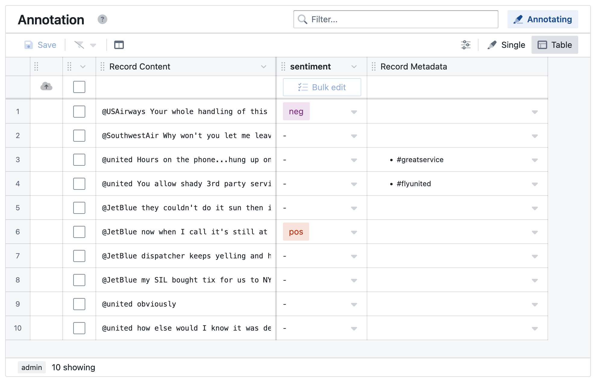
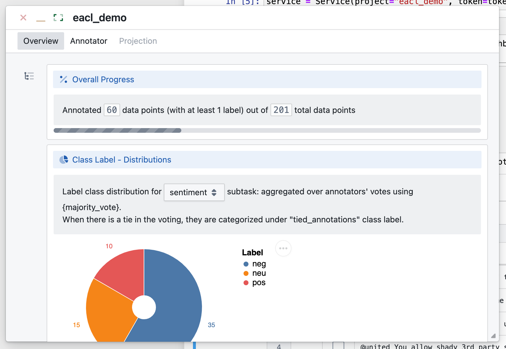

# Advanced features

This [notebook](https://github.com/megagonlabs/meganno-client/blob/main/Examples/Example%202%20-%20Advanced%20features%20(admin-only).ipynb) provides examples of some of the advanced features.


## Updating Schema
Annotation requirements can change as projects evolve. To update the schema for a project, simply call `set_schemas` with the new schema object.
For example, to expand the schema we set in the basic notebook:
```Python
demo.get_schemas().set_schemas({
    'label_schema': [
        {
            "name": "sentiment",
            "level": "record", 
            "options": [
                { "value": "pos", "text": "positive" },
                { "value": "neg", "text": "negative" },
                { "value": "neu", "text": "neutral" } # adding a new option
            ]
        },
        # adding a span-level label
                {
            "name": "sp",
            "level": "span", 
            "options": [
                { "value": "pos", "text": "positive" },
                { "value": "neg", "text": "negative" },
            ]
        }
    ]
})
```
Only the latest schema will be active, but all previous ones will be preserved. To see the full history:
```python
demo.get_schemas().get_history()
```

## Metadata
In Labeler, metadata refers to auxiliary information associated with data records. Labeler takes user-defined functions to generate metadata and uses it to find important subsets and assist human annotators. Here we show two examples.


Example 1:
Adding [sentence bert](https://www.sbert.net/) embeddings for data records. The embeddings can later be used to make similarity computations over records.
```python
# Example 1, adding sentence-bert embedding.
from sentence_transformers import SentenceTransformer
model = SentenceTransformer('all-MiniLM-L6-v2')
# set metadata generation function 
demo.set_metadata("bert-embedding",lambda x: list(model.encode(x).astype(float)), 500)
```

Example 2:
Extracting hashtags as annotation context.
```python
# user defined function to extract hashtag
def extract_hashtags(text):
    hashtag_list = []
    for word in text.split():
        if word[0] == '#':
            hashtag_list.append(word[:])
    # widget can render markdown text
    return ''.join(['- {}\n'.format(x) for x in hashtag_list])

# apply metadata to the project
demo.set_metadata("hashtag", lambda x: extract_hashtags(x), 500)
```

With `hashtag` metadata, Labeler widget can show it as context at annotation time.

```python
s1= demo.search(keyword='',
              limit=50,
              skip=0,
              meta_names=['hashtag'])
s1.show()
```


## Advanced Subset Generation
In addition to exact keyword matches, Labeler also provides more advanced approaches of generating subsets.
### Regex-based searches
Labeler supports searches based on regular expressions:
```python
s2_reg= demo.search(regex='.* (delay) .*',
                  limit=50,
                  skip=0)
s2_reg.show({'view':'table'})
```

### Subset Suggestion
Searches initiated by users can help them explore the dataset in a controlled way. Still, the quality of searches is only as good as users’ knowledge about the data and domain. Labeler provides an automated subset suggestion engine to assist with exploration. Embedding-based suggestions make suggestions based on data-embedding vectors provided by the user (as metadata). 

For example, suggest_similar suggests neighbors (based on distance in the embedding space) of data in the querying subset:

```python
s3 = demo.search(keyword='delay', limit=3, skip=0) # source subset
s4 = s3.suggest_similar('bert-embedding', limit=4) # needs to provide a valid meta_name
s4.show()
```

### Subset Computation
Labeler support set operations to build more subsets from others:
```python
# intersection
s_intersection = s1 & s2 # or s1.intersection(s2)
# union
s_union = s1 | s2 # or s1.union(s2)
# difference
s_diff = s1 - s2 # or s1.difference(s2)
```

## Dashboard (administrator-only)
Labeler provides a built-in visual monitoring dashboard to help users to get real-time status of the annotation project. As projects evolve, users would often need to understand the project’s status to make decisions about the next steps, like collecting more data points with certain characteristics or adding a new class to the task definition. To aid such analysis, the dashboard widget packs common statistics and analytical visualizations (e.g., annotation progress, distribution of labels, annotator agreement, etc.) based on a survey of our pilot users.



To bring up the project dashboard:
```python
demo.show()
```

*****
Other features

* Assignment and dispatch: You may assign a subset to a particular annotator
```python
s1.assign(annotator_id)
```


* Multiple annotators and reconciliation: You are also able to view a reconciled list of annotations from multiple annotators
```python
s1.get_reconciliation_data()
```