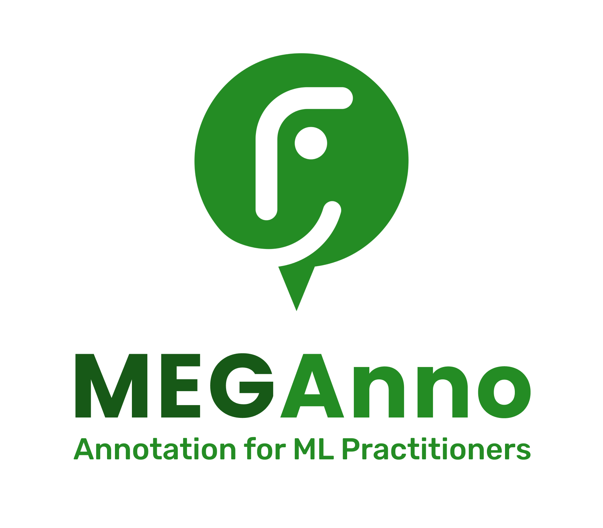
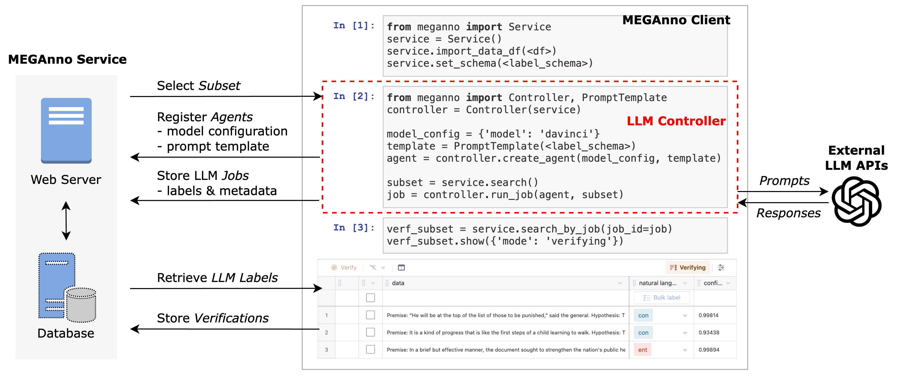

{: style="display:block;float:none;margin-left:auto;margin-right:auto;width:300px"}
#
## How to get started?

There are 2 ways to get started with MEGAnno:

**1. Demo system access:**
We prepared a Google Colab notebook for this demo. To run the Colab notebook, you’ll need a Google account, an OpenAI API key, and a MEGAnno access token (you can get this by filling out the [request form](https://meganno.github.io/#request_form)).  

**2. Your own MEGAnno environment:**
To set up MEGAnno for your own projects, you can set up your own self-hosted MEGAnno service.  Please follow the [self-hosted installation instructions](quickstart.md#self-hosted-service).

## What is MEGAnno?
Many existing data annotation tools focus on the annotator enabling them to annotate data and manage annotation activities.  Instead, MEGAnno is an open-source data annotation tool that puts the data scientist first, enabling you to bootstrap annotation tasks and manage the continual evolution of annotations through the machine learning lifecycle.  

In addition, MEGAnno’s unique capabilities include: 

* A back-end service that acts as a single source of truth and stores/manages all the evolution of annotation information through the lifecycle. 

* Power tools to explore data sets and select the best data to label.  Accommodations for active learning and other techniques to prioritize your labeling work.

* Explore the distribution of labels and the behavior of annotators to make decisions for subsequent labeling batches.  

* A data scientist-focused experience enabling you to manage annotation directly in your notebooks.  This allows you to utilize existing Python functions and our built-in power tools to optimize your annotation process.                       
* Seamlessly incorporate both human and LLM data labels with verification workflows and integration to popular LLMs.  This enables LLM agents to label data first while humans focus on verifying a subset of potentially problematic LLM labels.


<br/><span style="color: gray;">*Figure 1. MEGAnno's unique capabilities*</span>

## System Overview
MEGAnno provides two key components: (1) a Python client library featuring interactive widgets and (2) a back-end service consisting of web API and database servers. To use our system, a user can interact with a Jupyter Notebook that has the MEGAnno client installed. Through programmatic interfaces and UI widgets, the client communicates with the service.

<br/><span style="color: gray;">*Figure 2. Overview of MEGAnno+ system.*</span>


Please see the [Getting Started](quickstart.md) page for setup instructions and the [Advanced Features](advanced.md) page for more cool features we provide.

## Citation

Check out our research papers on [human-LLM collaborative annotation (EACL 2024 Demo)](https://aclanthology.org/2024.eacl-demo.18/) and [exploratory labeling (DaSH@EMNLP 2022)](https://aclanthology.org/2022.dash-1.1/).

If you use MEGAnno in your work, please cite as:

```bibtex
@inproceedings{kim-etal-2024-meganno,
    title = "{MEGA}nno+: A Human-{LLM} Collaborative Annotation System",
    author = "Kim, Hannah and Mitra, Kushan and Li Chen, Rafael and Rahman, Sajjadur and Zhang, Dan",
    editor = "Aletras, Nikolaos and De Clercq, Orphee",
    booktitle = "Proceedings of the 18th Conference of the European Chapter of the Association for Computational Linguistics: System Demonstrations",
    month = mar,
    year = "2024",
    address = "St. Julians, Malta",
    publisher = "Association for Computational Linguistics",
    url = "https://aclanthology.org/2024.eacl-demo.18",
    pages = "168--176",
}
```
```bibtex
@inproceedings{zhang-etal-2022-meganno,
    title = "{MEGA}nno: Exploratory Labeling for {NLP} in Computational Notebooks",
    author = "Zhang, Dan and Kim, Hannah and Li Chen, Rafael and Kandogan, Eser and Hruschka, Estevam",
    editor = "Dragut, Eduard and Li, Yunyao and Popa, Lucian and Vucetic, Slobodan and Srivastava, Shashank",
    booktitle = "Proceedings of the Fourth Workshop on Data Science with Human-in-the-Loop (Language Advances)",
    month = dec,
    year = "2022",
    address = "Abu Dhabi, United Arab Emirates (Hybrid)",
    publisher = "Association for Computational Linguistics",
    url = "https://aclanthology.org/2022.dash-1.1",
    pages = "1--7",
}
```