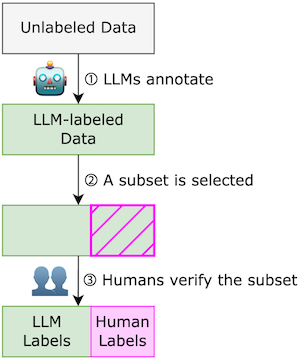

# LLM Integration

This [notebook](https://github.com/megagonlabs/meganno-client/blob/main/Examples/Example%203%20-%20LLM%20integration.ipynb) provides the flow for integrating LLMs within MEGAnno

MEGAnno offers a simple human-LLM collaborative annotation workflow: LLM annotation followed by human verification. Put simply, LLM agents label data first (Figure 2, step ①), and humans verify LLM labels as needed. For most tasks and datasets one can use LLM labels as is; for some subset of difficult or uncertain instances (Figure 2, step ②), humans can verify LLM labels – confirm the right ones and correct the wrong ones (Figure 2, step ③). In this way, the LLM annotation part can be automated, and human efforts can be directed to where they are most needed to improve the quality of final labels.

 *Figure 2. LLMs annotate, Humans verify*

## LLM Annotation

Users can specify a particular LLM model, define its configurations and customize a prompt template. This defines an _Agent_ which can be used for the annotation task. You may also re-use an _Agent_.

MEGAnno validates the model configuration chosen, and handles the call to the external LLM API to obtain LLM responses. Any API errors encountered during the call are also appropriately handled and a suitable message is relayed to the user. 

Once the responses are obtained, MEGAnno utilizes a **post-processing mechanism** (Figure 3) to extract the label from the LLM response. This ensures some minor deviations in the LLM's response (such as trailing period) are handled. Furthermore, users can set `fuzzy_extraction=True` which performs a fuzzy match between the LLM response and the label schema space. 

 *Figure 3. Example LLM responses and post-processing results by MEGAnno*

## Verification subset selection 

It would be redundant for a human to verify every annotation in the dataset as that would defeat the purpose of using LLMs for a cheap and faster annotation process. Instead, MEGAnno provides a possibility to aid the human verifiers by computing confidence scores for each annotation. Users can specify `confidence_score` of the LLM labels to be computed and stored. They can then view the confidence scores, and even sort as well as filter over them to obtain only those annotations for which the LLM had low confidence scores. This will ease the human verification process and make it more efficient.

## Human Verification

Users can then use MEGAnno's in-notebook widget to verify LLM labels i.e. either _confirm_ a label as correct or _reject_ the label and specify a correct label. Users may view the final annotations and export the data for further downstream tasks or analysis. 