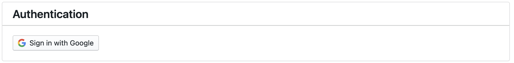

# Getting Started


## Installation

It is highly recommended to use a [virtual environment](https://docs.python.org/3/library/venv.html) or [conda environment](https://conda.io/projects/conda/en/latest/user-guide/tasks/manage-environments.html). 

1. To create a new environment:

    `conda create -n labeler python=3.9`

2. To activate the environment:

    `conda activate labeler`

3. To install the labeler-client lib (add `@vx.x.x` tag at the end of URL to specify the version):

    `pip install git+https://github.com/rit-git/labeler-client.git`


4. To register the new environment as a Jupyter kernel.

    `python -m ipykernel install --user --name=labeler`

5. To start using the client lib in a Jupyter notebook or Jupyter Lab page, in `Kernel` > `Change Kernel`  select the new labeler environment. 

    `import labeler_client`

## Authentication and Project Management [Megagon-only]
### Authentication
Megagon users can choose between two authentication methods to identify themselves and connect to a Megagon-hosted labeler service: `Google Auth` or `Tokens`.

* Option 1: Authenticate through Megagon email account. Note that sessions expire after 1 hour.
    ```python
    # To get your identifier for the labeler-service, run the following command to show the login UI.
    from labeler_ui import Authentication
    authentication = Authentication()
    authentication.show()
    ```
    

    After a successful login, the `authentication` object can be used to connect to the back-end service:
    ```Python
    from labeler_client import Service
    demo = Service(project = 'demo', auth = authentication)
    ```
* Option 2: After the initial authentication, you can generate a long-term token in the "token" tab of the authentication widget.

    
    Similarly, connect using tokens:

    ```Python
    from labeler_client import Service
    demo = Service(project = 'demo', token = xxx)
    ```


### Managing Projects

```python
# To bring up the project panel, run the following command to show the interface.
from labeler_client import Project
Project(auth = authentication).show()

# similarly, use token:
Project(token = xxx).show()
```


## Authentication [public]
Only token access is available for the public now. Please reach out to the admin to get a valid token.


## Basic Usages
Please also refer to this [notebook](https://github.com/rit-git/labeler-client/blob/main/Examples/Example%201%20-%20Basic%20pipeline.ipynb) for a running example of the basic pipeline of using labeler in a notebook.


### Setting Schema
*Schema* defines the annotation task. Example of setting schema for a sentiment analysis task with positive and negative options. 
```Python
demo.get_schemas().set_schemas({
    'label_schema': [
        {
            "name": "sentiment",
            "level": "record", 
            "options": [
                { "value": "pos", "text": "positive" },
                { "value": "neg", "text": "negative" },
            ]
        }
    ]
})
demo.get_schemas().value(active=True)		
```
A label can be defined to have level `record` or `span`. Record-level labels correspond to the entire data record, while span-level labels are associated with a text span in the record. See [Updating Schema](advanced.md#updating-schema) for an example of a more complex schema.

### Importing Data
Given a pandas [dataframe](https://pandas.pydata.org/docs/reference/api/pandas.DataFrame.html) like this (example generated from this [Twitter US Airline Sentiment dataset](https://www.kaggle.com/datasets/crowdflower/twitter-airline-sentiment)):

|   id | tweet                                        |
|-----:|:---------------------------------------------|
|    0 | @united how else would I know it was denied? |
|    1 | @JetBlue my SIL bought tix for us to NYC. We were told at the gate that her cc was declined. Supervisor accused us of illegal activity.                           |
|    2 | @JetBlue dispatcher keeps yelling and hung up on me!                        |

Importing data is easy by providing column names for `id` which is a unique importing identifier for data records, and `content` which is the raw text field.

```python
demo.import_data_df(df, column_mapping={
    'id':'id',
    'content':'tweet'
})
```

### Exploratory Labeling
Not all data points are equally important for downstream models and applications. There are often cases where users might want to prioritize a particular batch (e.g., to achieve better class or domain coverage or focus on the data points that the downstream model cannot predict well). Labeler provides a flexible and controllable way of organizing annotation projects through the exploratory labeling. This annotation process is done by first identifying an interesting subset and assigning labels to data in the subset. We provide a set of “power tools” to help identify valuable subsets.

The script below shows an example of searching for data records with keyword "delay" and bringing up a widget for annotation in the next cell. More examples [here](advanced.md#subset-suggestion).
```python
# search results => subset s1
s1 = demo.search(keyword='delay', limit=10, start=0)
# bring up a widget 
s1.show()
```

#### Column Filters

<br/><span style="color: gray;">*To view all column filters, click on "Filters" button; to reset all column filters, click on "Reset filters" button.*</span>

#### Column Order & Visibility

<br/><span style="color: gray;">
*1. To re-order and re-size column, mouse over column drag handler (left grip handler for re-order and right column edge for re-size).*
<br/>
*2. To toggle column visiblity, click on "Columns", then toggle column to show/hide.*
<br/>
*3. To reset column ordering and visibility, click on "Reset columns" button.*
</span>

#### Editing Modes

<br/><span style="color: gray;">*To toggle editing mode, click on the mode button, then toggle bewteen Annotating or Reconciling mode.*</span>

#### Metadata Focus-view

<br/><span style="color: gray;">*To focus on a single metadata value, click on "Settings" button, then choose a metadata name from the list.*</span>

### Exporting
Although iterations can happen within a single notebook, it's easy to export the data, and annotations collected:

```python
# collecting the annotation generated by all annotators
demo.export()
```


